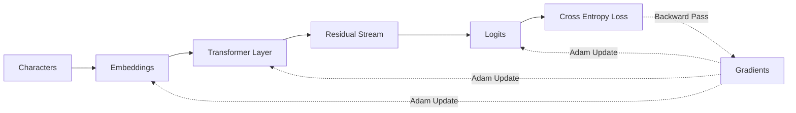
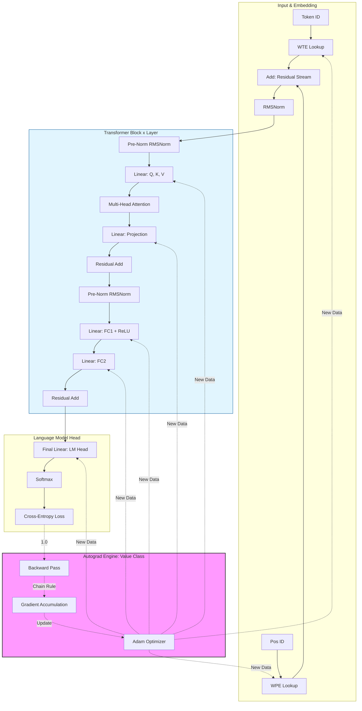

# microgpt-x: A Path to Enlightenment

This project implements a **Transformer-based Language Model** from the absolute ground up. Every weight, every neuron, and every attention score is a standalone object that knows how to calculate its own derivative.

## 🧠 Philosophy

Most deep learning libraries (PyTorch, TensorFlow) operate on **Tensors**. MicroGPT operates on **Scalars**.

Instead of using optimized CUDA kernels, this model builds a massive computational graph of thousands of `Value` objects. When you calculate the loss, you are left with a Directed Acyclic Graph (DAG) that represents the entire history of the forward pass. Calling `.backward()` then triggers a recursive chain-rule traversal through that entire history.

---

## 🏗️ The Architecture

The model follows the GPT-2 "Pre-Norm" design with a few modern simplifications:

* **Engine:** Scalar-level Autograd.
* **Normalization:** RMSNorm (Root Mean Square Layer Normalization).
* **Activation:** ReLU (instead of GeLU for simplicity).
* **Optimizer:** Adam with bias correction and linear learning rate decay.
* **Attention:** Multi-head Causal Self-Attention with KV caching during inference.

### The Computation Flow

1. **Tokenization:** Text is broken into individual characters.
2. **Embedding:** Characters and their positions are mapped to vectors of `Value` objects.
3. **The Residual Stream:** Information flows through layers. Each layer adds its contribution to the stream rather than replacing it.
4. **Attention:** Each token "looks back" at previous tokens to gather context.
5. **MLP:** A feed-forward network allows the model to "think" about the information gathered by the attention head.

---

## 🛠️ Component Breakdown

### 1. The Autograd Engine (`Value`)

The heart of the project. It stores data and a gradient.

```math
\text{child.grad} += \text{local\_grad} \times \text{v.grad}
```

By overriding Python's magic methods (`__add__`, `__mul__`), we build the graph automatically as we perform math.

### 2. The Model (`gpt`)

A function that defines the connectivity of the Transformer. It takes a token and a position, passes it through RMSNorm, Attention, and MLP blocks, and returns the "logits" (predictions for the next character).

### 3. The Optimizer (Adam)

A "blessed" version of Stochastic Gradient Descent. It uses two buffers (momentum and variance) to ensure that weights are updated efficiently, even when the gradients are noisy or sparse.

---

## 🚀 How to Run

1. **Data:** Ensure `names.txt` is in the directory. The model will learn to hallucinate new names.
2. **Training:** The loop iterates through the dataset, calculates the Negative Log Likelihood loss, and updates parameters.
3. **Inference:** Once trained, the model samples from its own predicted probability distribution to generate text.

---

## 📊 Visualizing the Graph



# microgpt-x



<!---  --->
